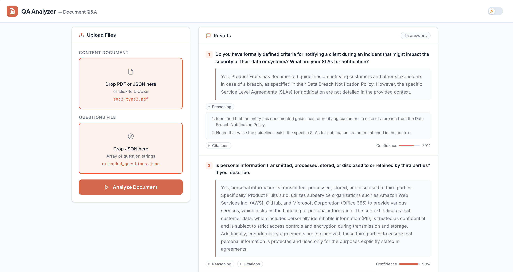

# Zania QA Application

*Fig. The interactive dashboard for uploading the files and expolring the results*

A backend API that answers questions from uploaded documents (PDF or JSON) using Retrieval-Augmented Generation (RAG).

**Stack:** FastAPI · LangChain · OpenAI gpt-4o-mini · Chroma (in-memory) · BM25 · uv

---

## How it works

1. Upload a document (PDF or JSON) and a questions file (JSON array of strings) via the web UI or API.
2. The document is chunked and indexed into a hybrid retriever (semantic via Chroma + lexical via BM25).
3. For each question, the system generates sub-queries and keywords, retrieves relevant chunks, and sends them to `gpt-4o-mini` with an anti-hallucination prompt.
4. All questions are answered concurrently. Each answer is returned as a structured object with an `answer`, `stepwise_reasoning`, `confidence` score, and `citations`. Returns `"Data Not Available"` when no relevant context is found.
5. Results are displayed in the interactive dashboard with a confidence bar and collapsible reasoning and citation panels.

---

## Setup

**Prerequisites:** Python 3.12+, [uv](https://docs.astral.sh/uv/)

```bash
uv sync
echo "OPENAI_API_KEY=your-key-here" > .env
```

---

## Running

**Locally:**
```bash
uv run uvicorn app.main:app --reload
```

**Docker:**
```bash
docker build -t zania-qa .
docker run -p 8000:8000 --env-file .env zania-qa
```

**docker-compose:**
```bash
docker-compose up --build
```

Available at `http://localhost:8000` · UI at `/` · Docs at `/docs`

---

## API

### `POST /api/v1/qa`

| Field | Type | Description |
|---|---|---|
| `document_file` | file | PDF or JSON document (max 20 MB) |
| `questions_file` | file | JSON array of question strings (max 50 questions) |

```bash
curl -X POST http://localhost:8000/api/v1/qa \
  -F "document_file=@document.pdf" \
  -F "questions_file=@questions.json"
```

```json
{
  "answers": {
    "What cloud providers are used?": {
      "answer": "AWS and GCP are used.",
      "stepwise_reasoning": ["The document lists AWS and GCP under cloud providers."],
      "confidence": 0.95,
      "citations": ["The company relies on AWS and GCP for cloud infrastructure."]
    },
    "Who is responsible for security incidents?": {
      "answer": "Data Not Available",
      "stepwise_reasoning": ["No relevant context found in the provided document."],
      "confidence": 0.0,
      "citations": []
    }
  }
}
```

**Error codes:** `415` unsupported file type · `422` malformed JSON · `413` file too large · `500` retriever failure · `502` LLM failure

### `GET /health`

Returns `{"status": "ok"}`.

---

## Configuration

| Variable | Default | Description |
|---|---|---|
| `OPENAI_API_KEY` | required | OpenAI API key |
| `OPENAI_MODEL` | `gpt-4o-mini` | Chat model |
| `EMBEDDING_MODEL` | `text-embedding-3-small` | Embedding model |
| `CHUNK_SIZE` | `1000` | Characters per chunk |
| `CHUNK_OVERLAP` | `200` | Overlap between chunks |
| `RETRIEVAL_K` | `15` | Chunks retrieved per sub-query |
| `BM25_WEIGHT` | `0.4` | BM25 weight in ensemble (semantic = 1 - this) |
| `MAX_CONCURRENT_QUESTIONS` | `50` | Concurrent question limit |
| `MAX_RETRIES` | `3` | Retries on OpenAI rate limit |
| `LLM_TIMEOUT_SECONDS` | `60.0` | Per-question LLM timeout |

All settings can be overridden via environment variables or `.env`. See `app/config.py` for the full list.

---

## Tests

```bash
uv run pytest tests/unit -v         # no API key required
uv run pytest tests/integration -v  # no API key required (mocked)
uv run pytest -v                    # all tests
```

Integration tests mock both the retriever and LLM — no `OPENAI_API_KEY` needed. Override fixture files with `TEST_DOCUMENT_PATH` and `TEST_QUESTIONS_PATH`.

---

## Logs

Structured JSON logs are written to stdout and `logs/app.log` (rotating, 30-day retention). Every request and LLM call is logged with latency and token usage.

---

## Evaluation

`scripts/eval.py` runs an LLM-as-judge evaluation against a golden dataset. It requires `OPENAI_API_KEY`.

```bash
# Run against the default SOC 2 document and golden dataset
uv run python scripts/eval.py

# Run against a custom document and golden dataset
uv run python scripts/eval.py \
  --document sample_docs/soc2-type2.pdf \
  --golden   sample_docs/golden_dataset.json
```

**How it works:**

1. Loads and chunks the document, builds the retriever, and answers all questions in the golden dataset using the full RAG pipeline.
2. For each Q/A pair, an LLM judge scores the system answer against the ideal answer on three axes (1–10):
   - **Completeness** — does it cover the key facts from the ideal answer?
   - **Accuracy** — are all stated claims factually correct per the ideal?
   - **Phrasing** — is the answer clear and concise? Key facts should be delivered directly with gaps noted inline; concise answers that cover the facts score as well as or better than longer ones.
3. Prints per-question results with scores and one-line reasoning, then a summary.
4. Saves full results (scores + reasoning) to `sample_docs/eval_results.json`.
5. Exits `0` if the overall average score across all axes and questions is ≥ 5/10, else `1`.

**Golden dataset format** (`sample_docs/golden_dataset.json`):
```json
[
  {
    "question": "What cloud providers are used?",
    "ideal_answer": "AWS and GCP are used as cloud providers."
  }
]
```

Entries without an `ideal_answer` are skipped. This lets you include exploratory questions in the dataset without blocking the eval.

---

## Design tradeoffs

### Chunking

**PDF — header-aware splitting:** PyMuPDF extracts to Markdown, then `MarkdownHeaderTextSplitter` splits on `##` section boundaries before sub-splitting into ~1000-char chunks. This preserves semantic boundaries (a section on access control stays together) at the cost of uneven chunk sizes — a short section produces a tiny chunk, a dense table produces many. The alternative (fixed-size sliding window) is simpler but routinely splits mid-sentence across section boundaries, hurting retrieval precision on structured compliance docs.

**Chunk size (1000 chars, 200 overlap):** Sized for compliance document sentences and table rows. Larger chunks reduce the number of LLM context slots used but increase noise per chunk; smaller chunks improve precision but fragment multi-sentence facts. The 200-char overlap prevents facts from being split exactly at a boundary.

---

### Retrieval

**Hybrid semantic + BM25 (60/40):** Semantic search (Chroma + `text-embedding-3-small`) handles paraphrase and synonym matching. BM25 handles exact keyword matching — critical for compliance documents where a specific term like `CC6.1` or `subservice organization` must appear verbatim. Neither alone is sufficient: pure semantic search misses exact terms; pure BM25 misses paraphrases. RRF fusion avoids the need to tune score thresholds across two different scoring scales.

**Query decomposition:** A single question may use terminology that doesn't match document vocabulary (e.g. "third parties" vs "subservice organizations"). Decomposition generates multiple phrasings to maximise recall. The tradeoff is latency and token cost — each sub-query is an extra LLM call and retrieval pass. The decomposition and keyword expansion calls run in parallel to contain this.

**Keyword expansion for BM25:** A separate LLM call extracts 6–10 short keywords optimised for BM25 matching. This improves BM25 recall on compliance-specific acronyms and policy names that query decomposition might miss. It's non-blocking — failure falls back to an empty keyword list.

**Chroma over FAISS:** FAISS would be marginally faster and lighter for this workload — it has no server/SQLite layer and a smaller dependency footprint. Chroma was chosen because it has a first-class persistence path (`persist_directory`): adding a document-hash-keyed cache to skip re-embedding on repeated calls is a one-argument change. With FAISS, the same feature would require a custom serialization layer (`faiss.write_index` / `faiss.read_index` + separate metadata storage). At the document scales this API handles the performance difference is negligible, so the lower future cost of adding persistence drives the choice toward Chroma.

**In-memory Chroma (no persistence):** The vector store is built fresh per request. This keeps the system stateless and horizontally scalable with no shared storage dependency, but means re-embedding the document on every call. For a single-document-per-request use case this is acceptable; for repeated queries against the same document, a persistent store keyed by document hash would eliminate redundant embedding calls.

---

### LLM answering

**`gpt-4o-mini` at temperature 0:** Chosen for cost and speed over more capable models. Temperature 0 makes outputs more deterministic, which matters for consistency across retries and for evaluability. The tradeoff is reduced reasoning ability on complex multi-hop questions — acceptable here because the prompt is designed to synthesise retrieved facts rather than reason from scratch.

**Chain-of-thought via `stepwise_reasoning`:** Asking the model to articulate its reasoning steps before committing to an answer is a form of chain-of-thought prompting. This measurably improves answer quality on multi-hop questions — the model is less likely to shortcut to a wrong answer when it must produce an auditable reasoning trace. The tradeoffs are increased latency and API cost.

**`confidence`:** A self-reported scalar (0–1). Self-assessed confidence is not perfectly calibrated — models tend to be overconfident on plausible-sounding answers and underconfident when the phrasing differs from the question vocabulary. Its value is relative rather than absolute: a 0.5 answer deserves more scrutiny than a 0.9 answer from the same model on the same document, even if the scores don't map to true probabilities.

**Latency impact:** Structured output adds two sources of latency over a plain-text call: the additional output tokens (reasoning + citations) and the overhead of OpenAI's function-calling parsing path. In practice the reasoning and citation fields are the dominant factor. For latency-sensitive applications, `stepwise_reasoning` could be omitted or generated only on low-confidence answers.

---


